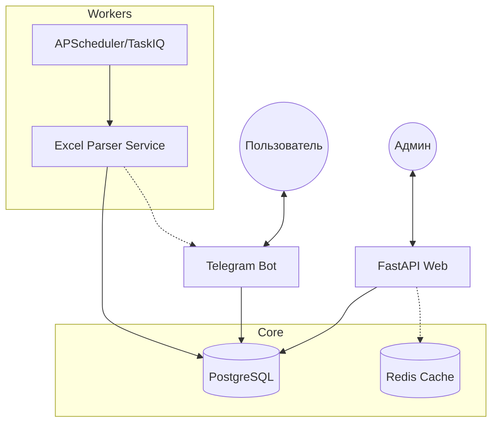

# Архитектурный анализ и предложения по улучшению AtermTrackBot

## 🏗 Текущее состояние
Система представляет собой монолитное приложение, разделенное на два основных процесса: Telegram-бот и веб-интерфейс на FastAPI. Оба процесса используют общую базу данных PostgreSQL и слой сервисов.

### Основные компоненты:
1. **Telegram Bot**: Основной интерфейс взаимодействия с пользователем.
2. **FastAPI Web App**: Панель администратора и кабинет клиента.
3. **Scheduler (APScheduler)**: Запущен внутри процесса бота, отвечает за импорт данных и рассылки.
4. **Services Layer**: Логика обработки Excel-файлов, работа с IMAP/SMTP и расчеты.

---

## 🚩 Выявленные проблемы и риски

### 1. Масштабируемость фоновых задач
* **Проблема**: Планировщик (`scheduler.py`) запущен непосредственно в `bot.py`.
* **Риск**: При попытке запустить несколько экземпляров бота (горизонтальное масштабирование) задачи планировщика (проверка почты, рассылки) будут дублироваться, что приведет к конфликтам и повторным уведомлениям.

### 2. Производительность веб-панели
* **Проблема**: Функция `get_dashboard_stats` выполняет 8 тяжелых SQL-запросов при каждой загрузке страницы.
* **Риск**: С ростом базы данных время загрузки дашборда будет линейно расти. Запросы с агрегацией по вычисляемым полям (например, средний срок доставки) создают высокую нагрузку на БД.

### 3. Сложность бизнес-логики (Fat Services)
* **Проблема**: Функция `process_dislocation_file` в `dislocation_importer.py` содержит более 200 строк кода, смешивая парсинг, приведение типов, бизнес-правила (определение новых рейсов) и сохранение в БД.
* **Риск**: Трудность в написании модульных тестов, высокий риск внесения ошибок при изменении формата входных данных.

### 4. Тесная связь (Coupling)
* **Проблема**: Планировщик жестко завязан на объект `bot` для отправки уведомлений.
* **Риск**: Сложно тестировать логику импорта в изоляции от Telegram API.

---

## 🚀 Предложенные улучшения

### Архитектурные изменения (High Level)

1. **Выделение Worker-процесса (Task Queue)**:
   - Внедрить **TaskIQ** или **Celery** для обработки фоновых задач.
   - Вынести планировщик и тяжелые задачи (парсинг Excel, рассылки) в отдельный процесс (Worker).
   - Это позволит масштабировать бот и веб-часть независимо от обработчика задач.

2. **Оптимизация работы с данными**:
   - **Кэширование дашборда**: Использовать Redis для кэширования результатов `get_dashboard_stats` на 15-30 минут.
   - **Материализованные представления (Materialized Views)** или агрегатные таблицы для статистики.

### Рефакторинг кода (Implementation Level)

1. **Разделение `process_dislocation_file`**:
   - Выделить `ExcelParser` (только чтение и нормализация данных).
   - Выделить `TripManager` (логика определения завершения рейса и начала нового).
   - Выделить `TrackingRepository` (чистые операции сохранения в БД).

2. **Улучшение работы с БД**:
   - Использовать `bulk_insert` или `bulk_update` для больших файлов дислокации вместо цикла с `session.merge`.
   - Перейти полностью на Alembic для управления схемой, удалив `init_db()` из кода приложения для продакшн-окружения.

3. **Асинхронность**:
   - Рассмотреть замену синхронных библиотек (например, `imap_tools` через `to_thread`) на полностью асинхронные аналоги, если это критично для производительности под нагрузкой.

---

## 🛠 План действий (Action Plan)

1. [ ] **Рефакторинг сервиса импорта**: Разбить `dislocation_importer.py` на мелкие модули и добавить unit-тесты на логику определения рейсов.
2. [ ] **Внедрение кэширования**: Добавить слой кэширования для тяжелых запросов в `web/routers/admin_modules/dashboard.py`.
3. [ ] **Отделение планировщика**: Переработать `scheduler.py`, чтобы он мог запускаться как независимый скрипт, не требуя инициализации полного приложения бота.
4. [x] **Оптимизация БД**: Проверить наличие индексов на часто используемых полях (`container_number`, `operation_date`, `waybill_id`) и добавить недостающие.

